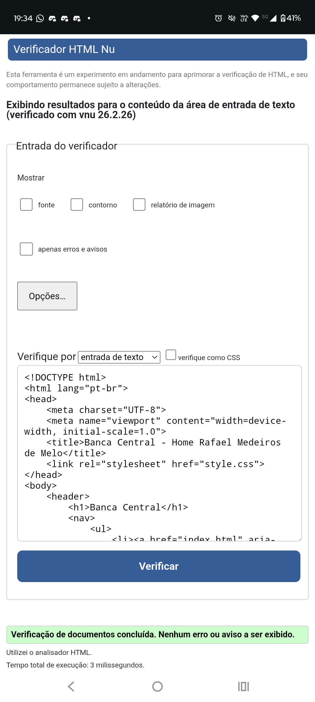
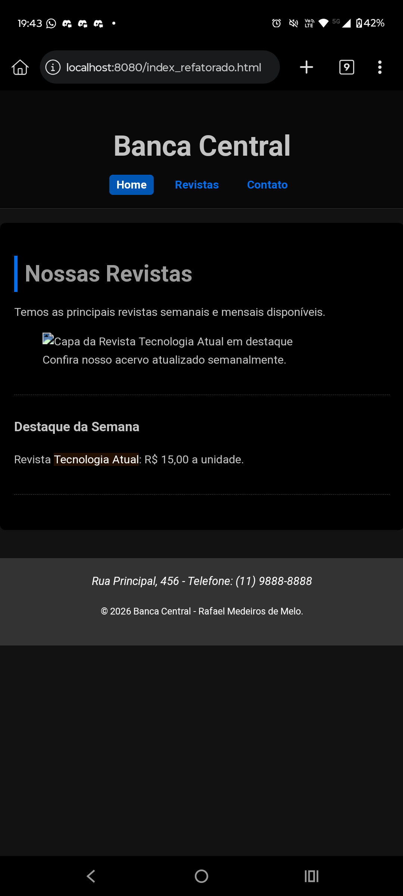

# Auditoria e Refatoração Front-End - Banca Central

**Aluno:** Rafael Medeiros de Melo  
**Data:** 02/03/2026

## 1. Identificação de Problemas (Auditoria)
Durante a análise do código original, foram identificados os seguintes pontos:
* **Falta de Semântica:** Uso excessivo de divs sem significado estrutural.
* **Estilos Inline/Internos:** CSS misturado com HTML, dificultando a manutenção.
* **Acessibilidade:** Imagens sem descrição (alt) e títulos fora de hierarquia.

## 2. Melhorias Implementadas (Refatoração)
* **HTML5 Semântico:** Implementação de tags `<header>`, `<nav>`, `<main>` e `<footer>`.
* **Separação de Camadas:** Criação do arquivo `style.css` externo.
* **Acessibilidade:** Adição de atributos ARIA e textos alternativos.
* **Validação:** Código validado sem erros no W3C Validator.

## 3. Evidências de Auditoria
Abaixo estão os prints comprovando a validade técnica do código:

